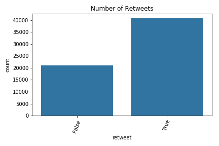
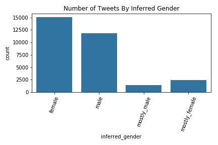
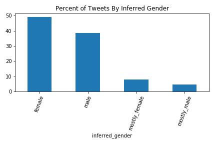
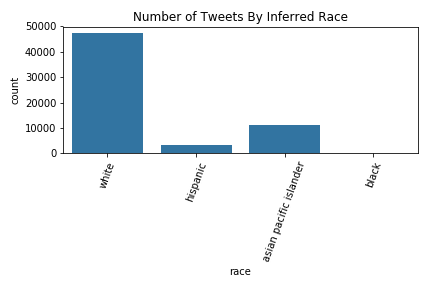

Twitter
=======================

The data featured below is pulled from Twitter during the SheHacks hackathon and analyzed using a variety of open source Python packages. It contains 61736 tweets from 2018-01-25 18:37 till 20180-01-27 20:30.

The data is ingested from Twitter using an API wrapper called [Tweepy](http://tweepy.readthedocs.io/en/v3.5.0/), which has built-in functionality for querying the API for keywords. In this case, we queried tweets with #MeToo in the text body.

Additional variables were inferred from the raw data including retweets, gender, and ethnicity.

### Retweets

### Infer User's gender
To infer the users' gender, we used a Python package called [SexMachine](https://pypi.python.org/pypi/SexMachine) that employs a gender classification model trained on over 40,000 first names. The model classifies first names as either unknown, male, female, mostly male, and mostly female.  

### Infer User's Ethnicity
The ethnicity inference was computed using the [ethnicolr](https://github.com/appeler/ethnicolr) package, which draws its predictions from a combination of the US Census database, Florida Voter Registration data, and Wikipedia data. The model classifiers and diagnostics for these packages were unfortunately not listed on the packages' websites. 

